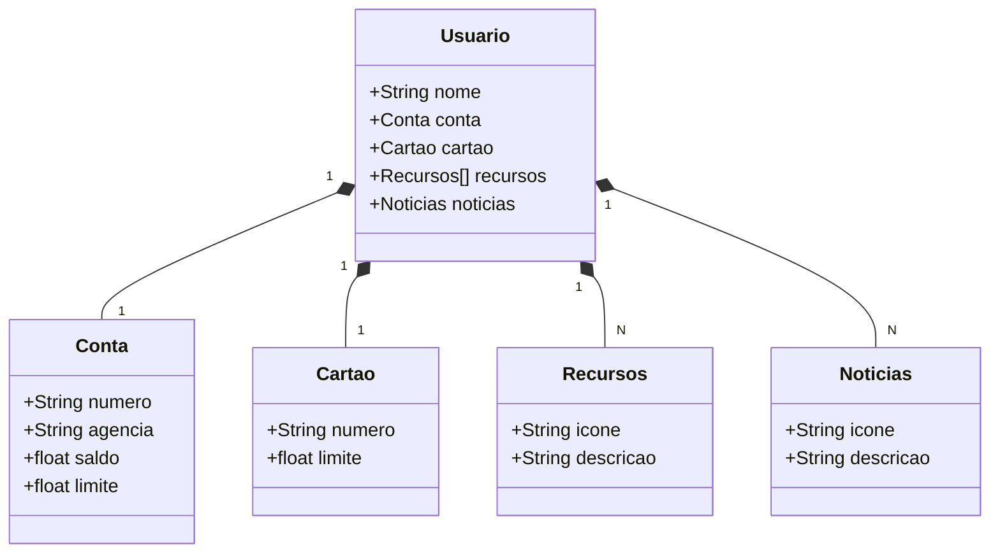

## Santander Bootcamp 2025  
Java RESTful API criado para o Santander Bootcamp 2025 na DIO  

### Diagrama de Classes  

```mermaid
classDiagram
    class Usuario {
        +String nome
        +Conta conta
        +Cartao cartao
        +Recursos[] recursos
        +Noticias noticias
    }

    class Conta {
        +String numero
        +String agencia
        +float saldo
        +float limite
    }

    class Cartao {
        +String numero
        +float limite
    }

    class Recursos {
        +String icone
        +String descricao
    }

    class Noticias {
        +String icone
        +String descricao
    }

    Usuario "1" *-- "1" Conta
    Usuario "1" *-- "1" Cartao
    Usuario "1" *-- "N" Recursos
    Usuario "1" *-- "N" Noticias

```
